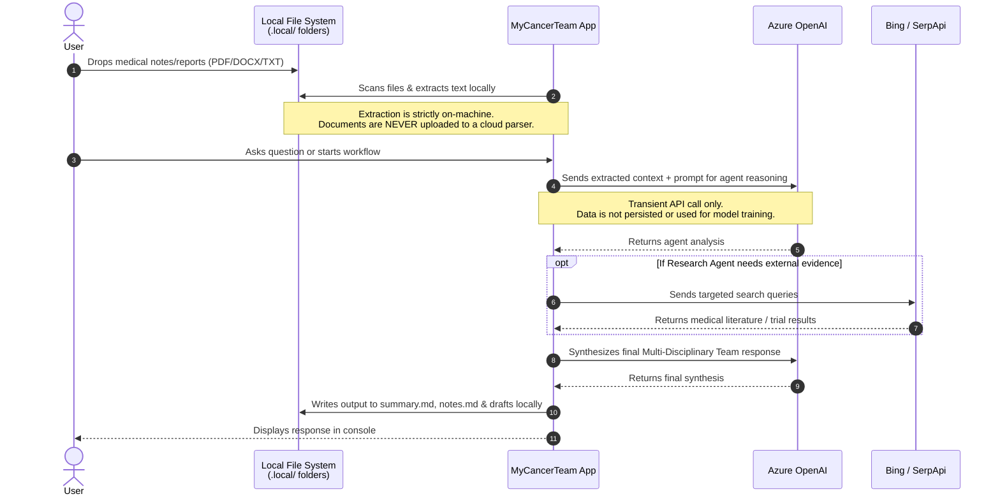

# Data Flow & Privacy Architecture

MyCancerTeam is built with a strict **local-first, privacy-by-default** architecture. Because cancer care involves highly sensitive personal and medical information, the system is designed to ensure that **no documents or personal data are persisted in any cloud storage or database**.

The only data that leaves your local machine are the transient API calls required for the AI reasoning and optional web searches.

### Key Privacy Guarantees

1. **Local Text Extraction**: PDFs and Word documents are parsed locally on your machine using open-source libraries (`PdfPig` and `Open-XML-SDK`). Files are never uploaded to a cloud service to be read.
2. **No External Persistence**: There is no SQL database, CosmosDB, or cloud blob storage configured. All state, memory, drafts, `summary.md`, and `notes.md` are kept exclusively in the `.local/` folder on your hard drive.
3. **Zero Telemetry**: The application does not send telemetry, usage logs, or analytics to any central server.
4. **Transient AI Inference**: Data sent to Azure OpenAI is processed for inference only. Under standard Azure OpenAI enterprise terms, your prompts and data are not used to train foundational models.
5. **Transient Search Queries**: If configured, search queries sent to Bing or SerpApi are strictly for retrieving current medical literature or trials, and no personal medical records are included in the search payloads.